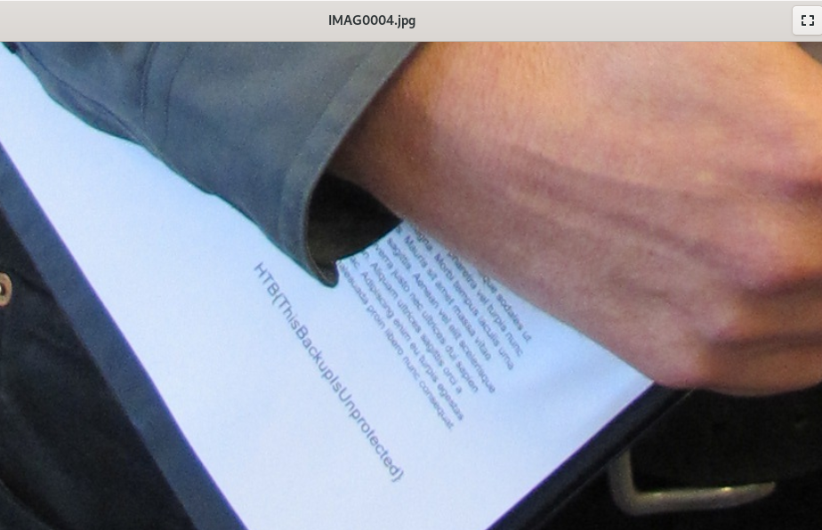

# # 02_Cat

```bash
( printf "\x1f\x8b\x08\x00\x00\x00\x00\x00" ; tail -c +25 cat.ab ) |  tar xfvz -
```

`/mnt/LDepo/Guvenlik/HackTheBox/02-Challenges/8Mobile/Cat/Cat/shared/0/Pictures/IMAG0004.jpg`

</a>